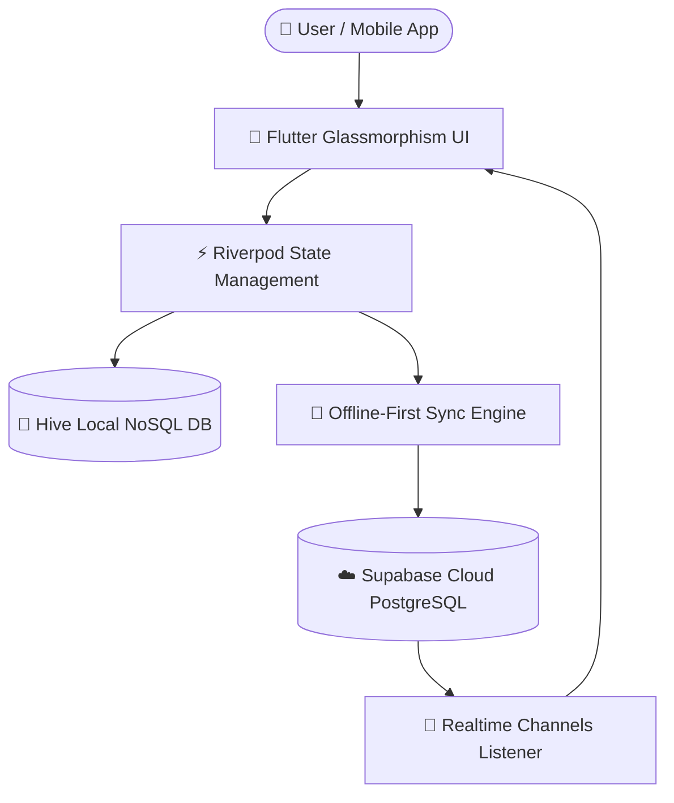

# 📖 01-Architecture Specification — Daily Savings Tracker

## 1. System Overview

The **Daily Savings Tracker** is an offline-first financial management platform designed to help users systematically build savings habits through a fixed daily target (default `150.000 VNĐ / day`), real-time streak calculations, annual financial forecasting, and long-term goal tracking (Wishlist).

---

## 2. Core Business Logic Specifications

### 2.1 Daily Pace & Target Calculation
- **Daily Target Goal ($G_d$):** Configurable, default $= 150.000\text{ VNĐ}$.
- **Daily Difference ($\Delta D$):**
  $$\Delta D = A_{actual} - G_d$$
- **Streak Calculation ($S$):** Consecutive days where cumulative daily total $\ge G_d$.

### 2.2 Annual Financial Forecasting Engine
- **Elapsed Days ($D_{elapsed}$):** Days passed since January 1st of current year.
- **Real Average Savings Rate ($R_{avg}$):**
  $$R_{avg} = \frac{\text{Total Year Savings}}{\max(1, \text{Days with Entries})}$$
- **Annual Forecast ($F_{year}$):**
  $$F_{year} = R_{avg} \times \text{Total Days in Year (365 or 366)}$$

### 2.3 Wishlist Goal Completion Days Forecast
- **Effective Daily Pace ($P_{eff}$):**
  $$P_{eff} = \max(R_{avg\_month}, G_d)$$
- **Remaining Amount ($A_{rem}$):**
  $$A_{rem} = \max(0, A_{target} - A_{current})$$
- **Days Needed ($D_{needed}$):**
  $$D_{needed} = \lceil \frac{A_{rem}}{P_{eff}} \rceil$$

---

## 3. Offline-First Sync Protocol

> [!TIP]
> All mutations (Create, Edit, Delete) execute **immediately against local storage** (zero latency), followed by an asynchronous background sync to Supabase Cloud.

1. **Local Write:** Entry written to Hive Box.
2. **Online Status Check:**
   - If **Online:** Send upsert payload to Supabase `savings_entries` table.
   - If **Offline:** Append mutation payload to pending sync queue.
3. **Reconnection Handler:** When network connectivity is restored, iterate pending sync queue and execute batch upserts.
